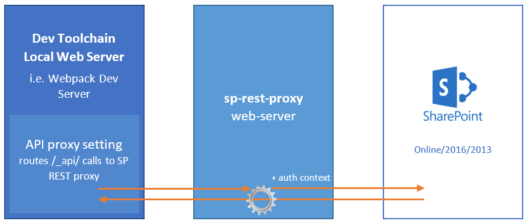
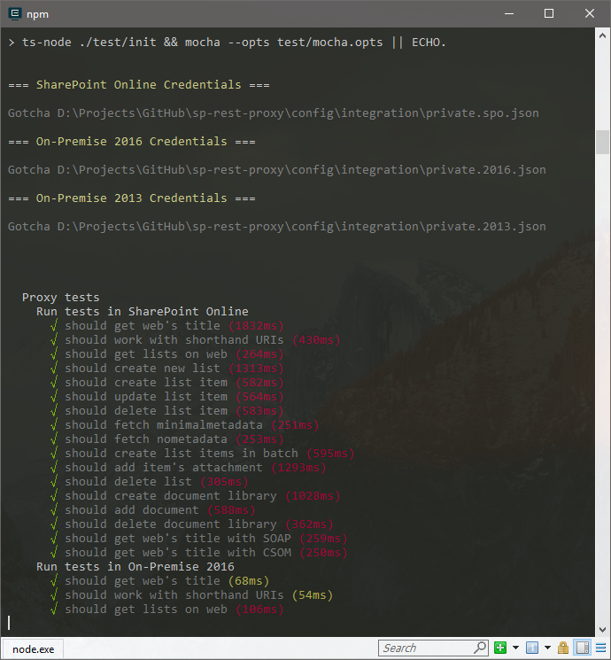

# sp-rest-proxy - SharePoint REST API Proxy for local Front-end development tool-chains

[](https://nodei.co/npm/sp-rest-proxy/)

[](https://badge.fury.io/js/sp-rest-proxy)
[](https://www.npmjs.com/package/sp-rest-proxy)
[](https://gitter.im/sharepoint-node/Lobby)

> Allows performing API calls to local Express application with forwarding the queries to a remote SharePoint instance.

Original concept of the proxy was created to show how it could be easy to implements real world data communications for SharePoint Framework local serve mode during web parts debug without deployment to SharePoint tenant. Now the tool is used with multiple teams for modern front-end solutions [rapid development](https://github.com/koltyakov/sp-rest-proxy#development-paradigms).



## Supports SPFx and PnP JS Core

## Supported SharePoint versions

- SharePoint Online
- SharePoint 2013
- SharePoint 2016

## Development paradigms

- SPA development ([Angular](http://johnliu.net/blog/2017/9/angular-4-sharepoint-on-premises-localhost-development-and-sp-rest-proxy), [React](https://www.linkedin.com/pulse/getting-started-react-local-development-sharepoint-andrew-koltyakov/), Vue.js, etc.) in serve mode against real data for On-Prem and Online
- [SharePoint Framework with local workbench](https://www.linkedin.com/pulse/local-spfx-workbench-against-real-sharepoint-api-andrew-koltyakov/)
- [SharePoint AddIns development](https://github.com/koltyakov/sp-rest-proxy/issues/41)

## Supports proxying

- REST API
- CSOM requests
- SOAP web services
- Static resources

## Proxy modes

- API Proxy server
- Socket gateway server
- Socket gateway client

Socket proxying allows to forward API from behind NAT (experimental).

## How to use as a module

1\. Install NPM module in the project:

```bash
npm install sp-rest-proxy --save-dev
```

or

```bash
yarn add sp-rest-proxy --dev
```

2\. Create server.js with the following code:

```javascript
const RestProxy = require('sp-rest-proxy');

const settings = {
  configPath: './config/private.json', // Location for SharePoint instance mapping and credentials
  port: 8080,                          // Local server port
  staticRoot: './static'               // Root folder for static content
};

const restProxy = new RestProxy(settings);
restProxy.serve();
```

[Configuration parameters cheatsheet](https://github.com/koltyakov/sp-rest-proxy/tree/master/docs/authparameters.md)

3\. Add npm task for serve into package.json:

```json
"scripts": {
  "serve": "node ./server.js"
}
```

Check if the path to server.js is correct.

4\. Run `npm run serve`.

5\. Provide SharePoint configuration parameters.

6\. Test local API proxy in action.

## How to develop

### Install

1\. Clone/fork the project:

```bash
git clone https://github.com/koltyakov/sp-rest-proxy
```

2\. CMD to the project folder.

3\. Install dependencies:

```bash
npm install
```

or

```bash
yarn install
```

4\. Build:

```bash
npm run build
```

5\. Run the server:

```bash
npm run serve
```

or serve in TypeScript directly

```bash
npm run ts-serve
```

Prompts credentials for a SharePoint site.

6\. Navigate to `http://localhost:8080` (or whatever in settings)

7\. Ajax REST calls as if you were in SharePoint site page context:


8\. Tests.

```bash
npm run test
```



## Authentication settings

The proxy provides wizard-like approach for building and managing config files for [`node-sp-auth`](https://github.com/s-KaiNet/node-sp-auth) (Node.js to SharePoint unattended http authentication).

- SharePoint 2013, 2016:
  - Addin only permissions
  - User credentials through the http ntlm handshake
  - Form-based authentication (FBA)
- SharePoint Online:
  - Addin only permissions
  - SAML based with user credentials
  - ADFS user credentials (works with both SharePoint on-premise and Online)

For more information please check node-sp-auth [credential options](https://github.com/s-KaiNet/node-sp-auth#params) and [wiki pages](https://github.com/s-KaiNet/node-sp-auth/wiki).
Auth settings are stored inside `./config/private.json`.

## PnP JS Core

sp-rest-proxy works with PnP JS Core (check out [brief notice](https://github.com/koltyakov/sp-rest-proxy/issues/26) how to configure).


### Load page context helper

sp-rest-proxy includes helper method for configuring page context - `loadPageContext`.

```typescript
import { loadPageContext } from 'sp-rest-proxy/dist/utils/env';
import { Web } from '@pnp/sp';

// loadPageContext - gets correct URL in localhost and SP environments
loadPageContext().then(async _ => {

  // In both localhost and published to SharePoint page
  // `_spPageContextInfo` will contain correct info for vital props

  // PnPjs's Web object should be created in the following way
  const web = new Web(_spPageContextInfo.webAbsoluteUrl);

  // Then goes ordinary PnPjs code
  const batch = web.createBatch();

  const list = web.getList(`${_spPageContextInfo.webServerRelativeUrl}/List/ListName`);
  const entityName = await list.getListItemEntityTypeFullName();

  [1, 2, 3, 4].forEach(el => {
    list.items.inBatch(batch).add({
      Title: `${el}`
    }, entityName);
  });

  await batch.execute();
  console.log('Done');

}).catch(log);
```

## SharePoint Framework

[Blog post article with setting up SPFx and Proxy](https://www.linkedin.com/pulse/local-spfx-workbench-against-real-sharepoint-api-andrew-koltyakov/)

## Use cases

- Client side applications development with local serve, but real data from SharePoint
- SharePoint Framework in local workbench with real data
- Client applications integration test automation scenarios

## Usage with Docker

- [Docker Hub](https://hub.docker.com/r/koltyakov/sp-rest-proxy/)
- [Local example](https://github.com/koltyakov/sp-rest-proxy/tree/master/docker)
