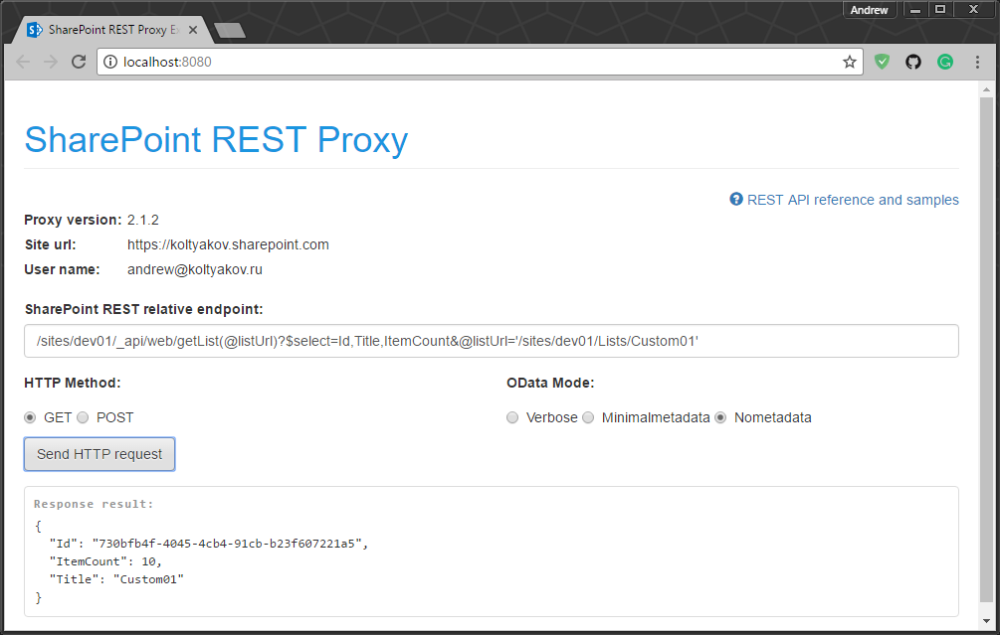

# sp-rest-proxy - SharePoint REST API Proxy for Node.js and Express local serve

> Concept for REST API proxy to SharePoint tenant as if it were a local API.

[](https://nodei.co/npm/sp-rest-proxy/)

[](https://badge.fury.io/js/sp-rest-proxy)
[](https://www.npmjs.com/package/sp-rest-proxy)

Allows to perform API calls to local Express application with forwarding the queries to a remote SharePoint instance.

This concept was created to show how is could be easy to implements real world data communications for SharePoint Framework local serve mode during web parts debug without deployment to SharePoint tenant.

## Supported SharePoint versions:
- SharePoint Online
- SharePoint 2013
- SharePoint 2016

## How to use as a module:

1\. Install NPM module in the project:

```bash
npm install --save-dev sp-rest-proxy
```

2\. Create server.js with the following code:

```javascript
var RestProxy = require("sp-rest-proxy");

var settings = {
    configPath: __dirname + "/config/_private.conf.json", // Location for SharePoint instance mapping and credentials
    port: 8080,                                           // Local server port
    staticRoot: __dirname + "/static"                     // Root folder for static content
};

var restProxy = new RestProxy(settings);
restProxy.serve();
```

3\. Add npm task for serve into package.json:

```json
"scripts": {
    "serve": "node ./server.js"
}
```

Check if the path to server.js is correct.

4\. Run `npm run serve`.

5\. Provide SharePoint configuration parameters.

6\. Test local API proxy in action.

## How to develop:

### Install:

1\. Clone the project:

```bash
git clone https://github.com/koltyakov/sp-rest-proxy
```

2\. CMD to the project folder.

3\. Install dependencies:

```bash
npm run build
```

4\. Run the server:

```bash
npm run serve
```

Prompt credentials for a SharePoint site.

5\. Navigate to http://localhost:8080

6\. Ajax REST calls as if you were in SharePoint site page context:

